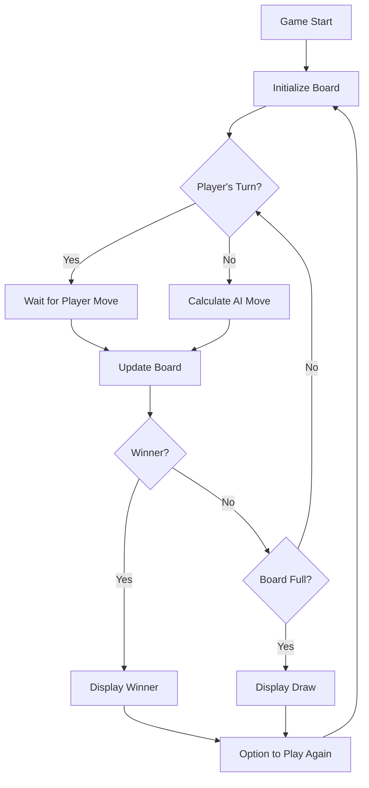

# NEXUS | Tic Tac Toe

## [Click Here to PLAY](https://v0-three-in-a-row-six.vercel.app/) ##

A futuristic implementation of the classic tic-tac-toe game, built with Next.js, TS and React.

## 📚 Tech Stack

- **Framework**: [Next.js](https://nextjs.org/)
- **Language**: [TypeScript](https://www.typescriptlang.org/)
- **Styling**: [Tailwind CSS](https://tailwindcss.com/)
- **Font**: [Geist Mono](https://vercel.com/font)

## 🌟 Features

- 🎮 Player vs AI gameplay
- 🧠 Strategic AI with multiple difficulty levels
- ✨ Cyberpunk-inspired UI with glow effects
- ⌨️ Typewriter text animations
- 🎯 Win detection with animated victory lines
- 🔄 Responsive design for all devices

## 🏗️ Project Structure

```
app/
├── components/
│   ├── Board.tsx       # Game board component
│   ├── Game.tsx        # Main game logic and state management
│   ├── Square.tsx      # Individual square component
│   ├── TypewriterText.tsx # Animated text component
│   └── WinningLine.tsx # Victory line animation
├── utils/
│   └── gameLogic.ts    # Game logic utilities
├── layout.tsx          # Root layout component
└── page.tsx            # Home page component
```

## 🔄 Game Flow



## 🧠 AI Implementation

The AI uses a strategic decision-making process with the following priority:

1. **Win**: If possible, make a move that results in a win
2. **Block**: Block the player from winning
3. **Center**: Take the center if available
4. **Corners**: Take an available corner
5. **Sides**: Take an available side


## 🎨 Design Elements

| Component | Description |
|-----------|-------------|
| **X Symbol** | Cyan glowing lines with crossover effect |
| **O Symbol** | Purple glowing circular outline |
| **Board** | Dark background with subtle grid lines |
| **Winning Line** | Animated gradient line with glow effect |
| **Typography** | Monospace font with typewriter animation |
| **Background** | Dark gradient with subtle tech patterns |

## 🚀 Getting Started

### Prerequisites

- Node.js 14.x or higher
- npm or yarn

### Installation

1. Clone the repository
```bash
git clone https://github.com/yourusername/nexus-game.git
cd nexus-game
```

2. Install dependencies
```bash
npm install
# or
yarn install
```

3. Run the development server
```bash
npm run dev
# or
yarn dev
```

4. Open [http://localhost:3000](http://localhost:3000) in your browser

## 🏆 Game Outcomes

- **Player Wins**: Congratulatory message with animation
- **AI Wins**: AI victory message with option to play again
- **Draw**: Draw message with option to play again

## 📱 Responsive Design

The game is fully responsive and works on:
- Desktop browsers
- Tablets
- Mobile devices

## 📝 License

This project is licensed under the MIT License - see the [LICENSE](LICENSE) file for details.

## 👤 Author

Srikar045 - [GitHub Profile](https://github.com/Arknight007),</br>
Built with TS and Next.JS

---
`© 2025 Arknight007. All rights reserved.`

